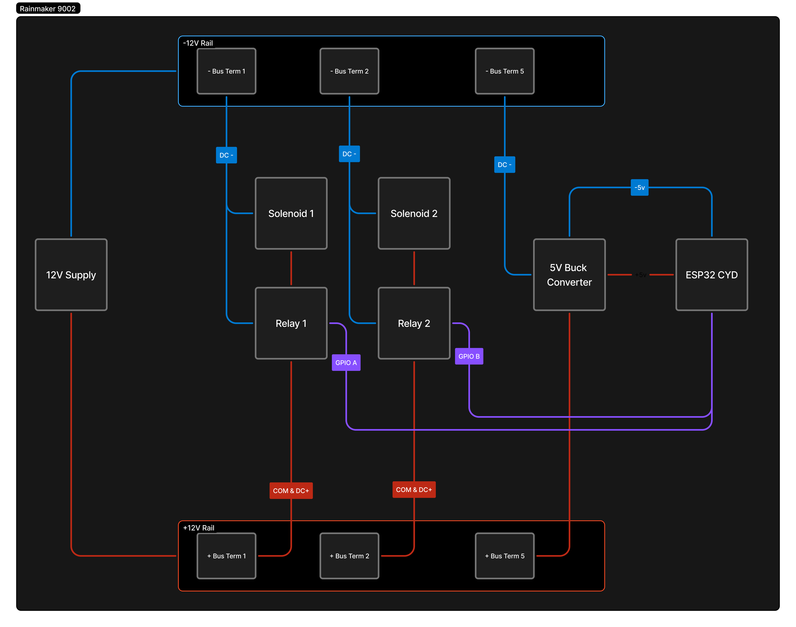
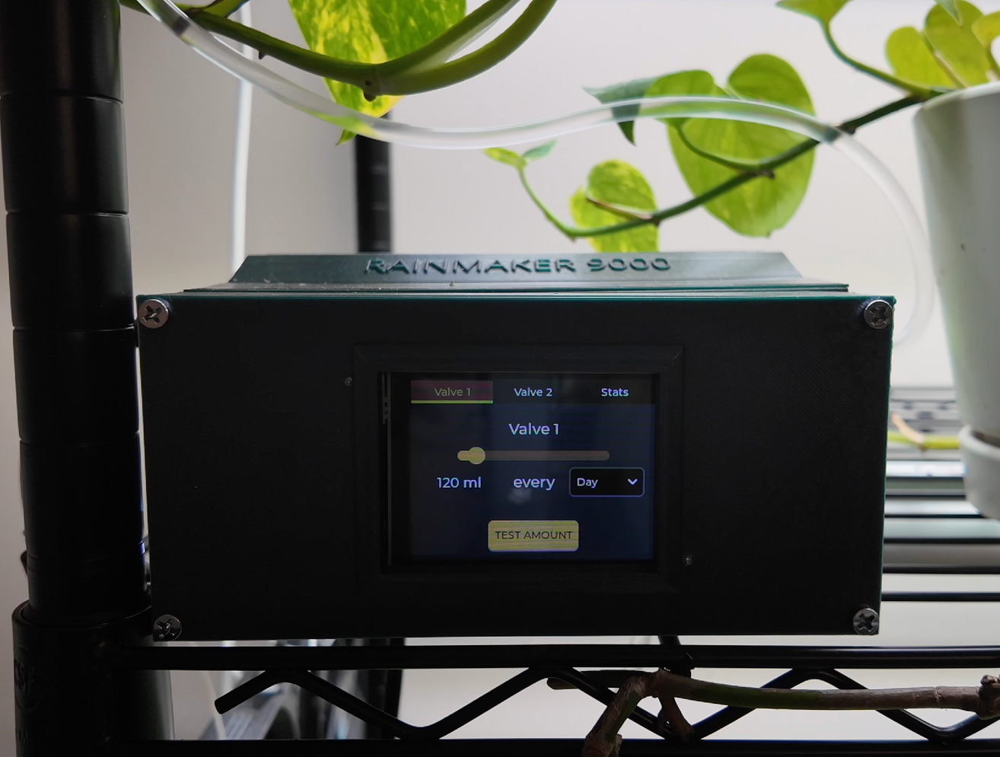

# 🌧️ Rainmaker 9000

**Rainmaker 9000** is a modular, gravity-fed, automatic plant watering system powered by an ESP32 microcontroller with a touchscreen interface. It lets you configure and automate watering schedules for 2 independently controlled solenoid valves—no plumbing skills required.

This project is ideal for makers, tinkerers, and home gardeners who want to combine DIY electronics with smart automation.

---

## 🛠️ Features

* 💧 Gravity-fed system for silent, energy-efficient watering
* ⏱️ Per-valve scheduling: set volume in mL per day or week
* 🔌 Touchscreen interface with intuitive controls (built using LVGL)
* 🧰 Fully open source: firmware, 3D models, and schematic included

---

## 📁 Repository Structure

```
rainmaker9000/
├── rainmaker9000.ino        # Arduino firmware for the ESP32
├── models/                  # 3D-printable STL files for the housing & modules
├── schematic.png            # Wiring diagram for electronics
├── image1.png               # Photo of the completed project
└── README.md                # This file
```

---

## 📸 Images

### 🔌 System Schematic



### 🌿 Completed Build



---

## 🧠 How It Works

1. A **top-mounted water reservoir** feeds a water rail via gravity.
2. The ESP32 controls **relay-driven solenoid valves** via a shift register or GPIO expansion.
3. Each module contains a relay+valve and passes control/data downstream.
4. The **touchscreen interface** allows users to configure:

   * Milliliters per watering cycle
   * Frequency: daily or weekly
5. The system saves user settings and tracks the last watering time.

---

## 🧪 Getting Started

### 📦 What You Need

* 1x ESP32 CYD Dev Board with touchscreen (LVGL-compatible)
* 12V DC power supply
* 12V solenoid valves
* 12V Relay modules (1 per valve)
* 1/4 OD Tubing & fittings
* 3D-printed housing (in `models/`)

### 🚀 Upload Firmware

1. Open `rainmaker9000.ino` in Arduino IDE.
2. Install dependencies (LVGL v9+, TFT_eSPI, XPT2046_Touchscreen, etc.).
3. Set your board and port.
4. Upload the firmware to your ESP32.

---

## 🖨️ 3D Printing

All STL files for the Rainmaker 9000 modular enclosure and parts are in the `/models` folder. Files are optimized for FDM printing.

---

## 🧩 Roadmap / Coming Soon

* Modular design with expanable numbers of valves
* Moisture sensor integration
* Wi-Fi + mobile dashboard (optional module)
* Kit version for public release

---

## 📜 License

This project is licensed under the MIT License.
Feel free to use, modify, and distribute it.

---

## 🤝 Contributing

Pull requests, bug reports, and suggestions are welcome!
Feel free to fork this repo or open an issue if you have ideas or need help.
